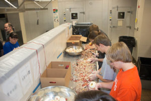
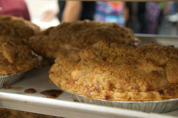
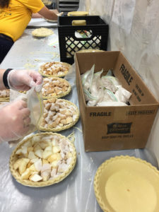
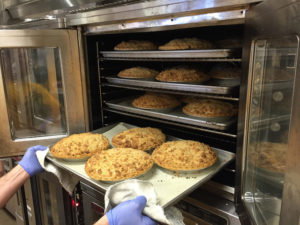

For over a decade, Team 467 has been building, baking, and selling fresh apple pies as one of the team’s primary student-run fundraisers.



This year the students plan to produce around 750 pies to help the team to be able to compete in the First Robotics Competition season. Team 467 makes a point to reserve a generous set of pies each year to donate to local charities. Recent recipients have been Veterans, Inc., and The Worcester County Food Bank.



Our crumble-top pies are baked under the watchful eyes of the Oak Middle School kitchen staff. The pies are all vegetarian and are absolutely delicious! We obtain our apples from Lanni Orchard here in Massachusetts. The Team starts with 65 bushels of apples that are peeled, sliced, and prepared, all in one day.



This year we will be baking pies at Oak Middle School on November 23, 2024. Most pies are sold by pre-purchase. In addition, we will have a table at the Winter Market, in the Oak Middle School gym for $24 each while supplies last, on the same day. We expect the pies at the Market to sell quickly!



The best way to pre-purchase our apple pies is to contact one of the student team members directly. Each student has pie tickets to sell for $24 each. Each ticket you buy allows you to pick up one fresh apple pie at Oak Middle School on 11/23. If you don’t know a student on the team, you can email us at [pies@shrewsburyrobotics.org](mailto:pies@shrewsburyrobotics.org), providing your contact information. One of the student team members will contact you to sell you a pie ticket.





***
See the fun for yourself with this video from a few years ago:



***

***Pies will need to be picked up at Oak Middle School Cafeteria between 2-5pm on 11/23.***

