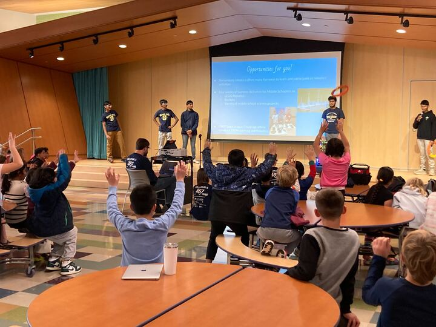
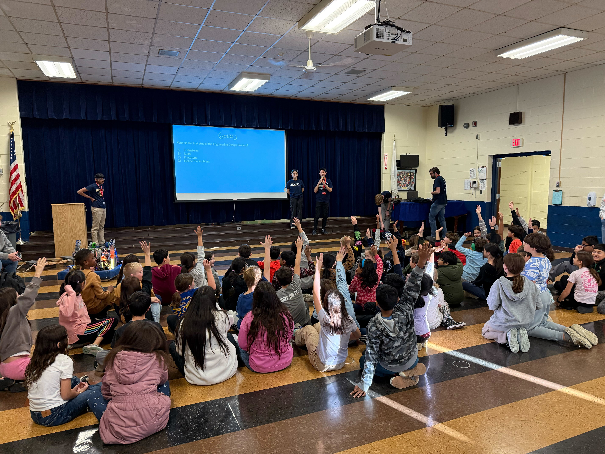
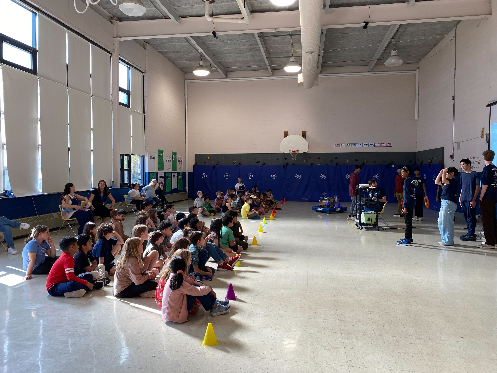

Team 467 is committed to spreading STEM to the next generation of engineers. Every year, a group of students from Team 467 visits the elementary schools in the [Shrewsbury Public Schools District](https://schools.shrewsburyma.gov/) to teach 4th graders about the engineering design process—and our robot **_SHUFFLE_**. At their schools they take part in curriculum related to the engineering and design process and showing our robot is one great way for them to experience it in real life.

 







 

Our presentations consisted of a informational section related to the engineering and design process followed by a demo of our 2024 robot **_SHUFFLE_**, and even a quiz following the presentation with prizes! Overall, this is a great way to spread STEM awareness and help gain support for our team.

 











### Presentation Dates in 2024
    Oct 23rd      Spring Street School
    Nov 4th       Beal School
    Nov 21st      Paton School
    Dec 6th       Coolidge School
    Dec 18th      Floral School

