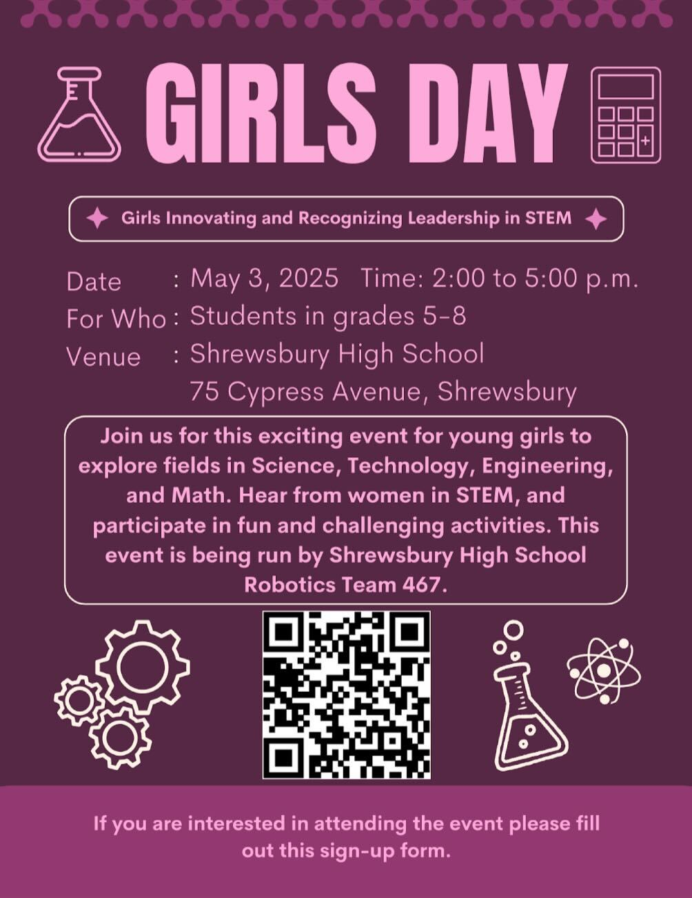





**The G.I.R.L.S.** (***Girls Innovating and Recognizing Leadership in STEM***) Day event is an annual exciting and interactive event for girls in grades 5-8. The event will be held this year at Shrewsbury High School, (75 Cyprus Avenue, Shrewsbury, MA 01545) on Saturday May 3rd, 2025, from 2-5pm.

We will have a number of female guest speakers from a variety of STEM fields. They will be talking about women’s roles in the workplace, highlighting their own careers and answering questions. There will also be various hands-on challenges for the participants, which will get the gears turning in their heads.

This event is being run by Shrewsbury _FIRST_ Robotics Team 467. Our goal is to emphasize women’s role in engineering to middle school girls. Click here to [sign up](https://docs.google.com/forms/d/e/1FAIpQLSco-W61F7QZJWANu9m_O13jFJvLGpK8CkpsWN75dUcdYh_Rmg/viewform).

We hope to see you there!

Thank you,

GIRLS Day Committee on Team 467

