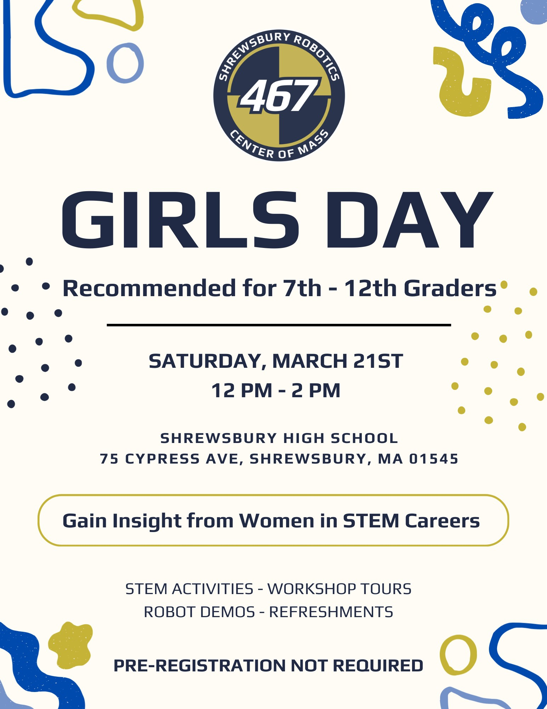





**The GIRLS Day** event is an annual exciting and interactive event for girls in grades 7-12. The event will be held this year at Shrewsbury High School, (75 Cyprus Avenue, Shrewsbury, MA 01545) on Saturday March 21st, 2026, from 12-2pm.

We will have a number of female guest speakers from a variety of STEM fields. They will be talking about women’s roles in the workplace, highlighting their own careers and answering questions. There will also be various hands-on challenges for the participants, which will get the gears turning in their heads.

This event is being run by Shrewsbury _FIRST_ Robotics Team 467. Our goal is to emphasize women’s role in engineering. 

We hope to see you there!

Thank you,

GIRLS Day Committee on Team 467

