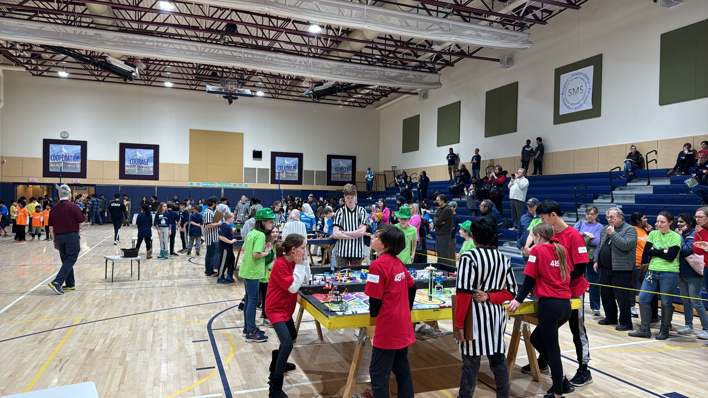





Every year, Team 467 holds one of the, if not the, longest running FLL qualifier in Massachusetts: Mindstorm Mayhem, the Shrewsbury FLL Qualifier in December at Sherwood Middle School. This event is always packed with up to 36 teams competing for the 11 spots that are offered for the State Tournament at WPI. This event is always a lot of fun, and we are always amazed by the creativity and talent that these children demonstrate year in and year out. The event is free and open to the public.




---


This event is completely run by Team 467. Our team members gather on the night before the event to set everything up, leading into Saturday where the team completely plans, queues, and judges the competition. We publicize the event in our local community, leading to many parents attending to find out what _FIRST_ is all about.





---

This year, MindStorm Mayhem will be held on **December 7th, 2024**. The entry fee for teams is **$150**.

**Payment is due on November 29th**

Payment Information:

    Payment types accepted: Check
    Payment Amount: $150.00
    Checks Payable To: Shrewsbury Robotics

    Remit Payment To:
    Shrewsbury Robotics
    100 Maple Ave.
    Shrewsbury MA 01545
    Attn: Carol McInally

---

If your team is no longer able or interested in attending an event, please email mafll@wpi.edu and let us know as soon as possible.

---

The schedule for the day will be (the schedule is subject to change):

    07:30 AM - Team arrival / Pits are open / Team registration
    08:15 AM - Coaches Meeting
    08:45 AM - Opening ceremony
    09:00 AM - Rank matches and judging sessions begin
    12:00 PM - Rank matches and judging sessions end
    12:00 PM - Lunch Break
    01:00 PM - Eliminations Begin
    04:30 PM - Awards ceremony
    05:00 PM - Load Out

Teams are guaranteed a minimum of 3 matches in order to achieve their highest score (we have 5 matches scheduled). Only your highest score counts towards qualification.

---

## Welcome to the SUBMERGED Season



### Explore the Future

In the [**SUBMERGED℠**](https://www.firstinspires.org/resource-library/fll/challenge/challenge-and-resources) challenge, _FIRST_ LEGO League teams will use creative thinking and LEGO technology to explore the layers of the ocean and bring their learnings and ideas to the surface as they “sea” into the future





---
