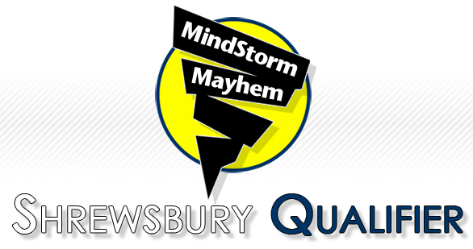

Every year, Team 467 holds the largest FLL qualifier in Massachusetts: Mindstorm Mayhem in December at Sherwood Middle School. This event is always packed with almost 50 teams competing for the 11 spots that are offered for the State Tournament at WPI. This event is always a lot of fun, and we are always amazed by the creativity and talent that these children demonstrate year in and year out.

This event is completely run by Team 467. Our team members gather on the night before the event to set everything up, leading into Saturday where the team completely plans, queues, and judges the competition. We publicize the event in our local community, leading to many parents attending to find out what _FIRST_ is all about. Our School Superintendent attended this year and applauded us on our continued efforts every year!!
