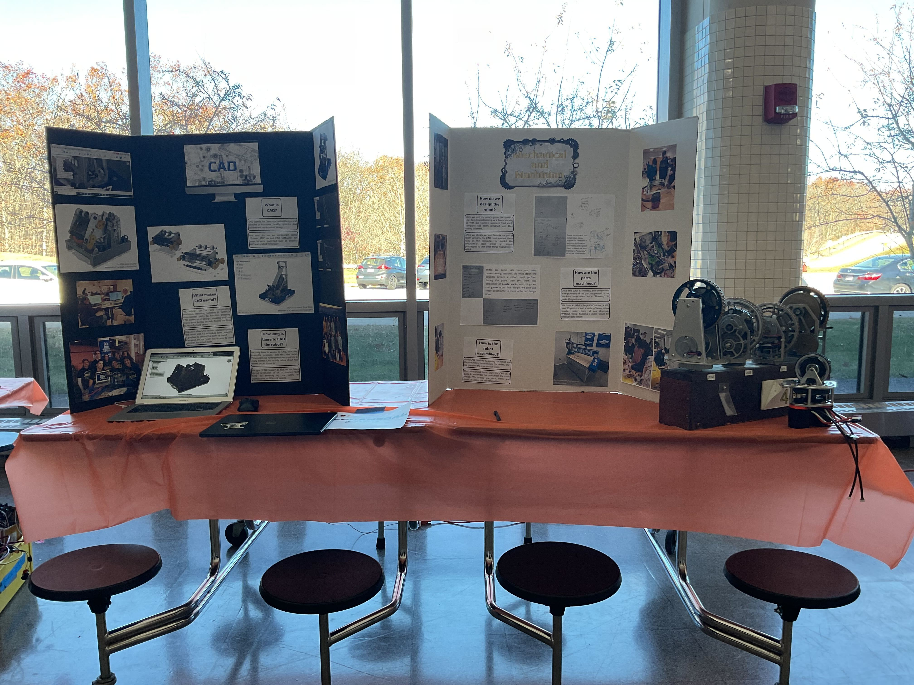
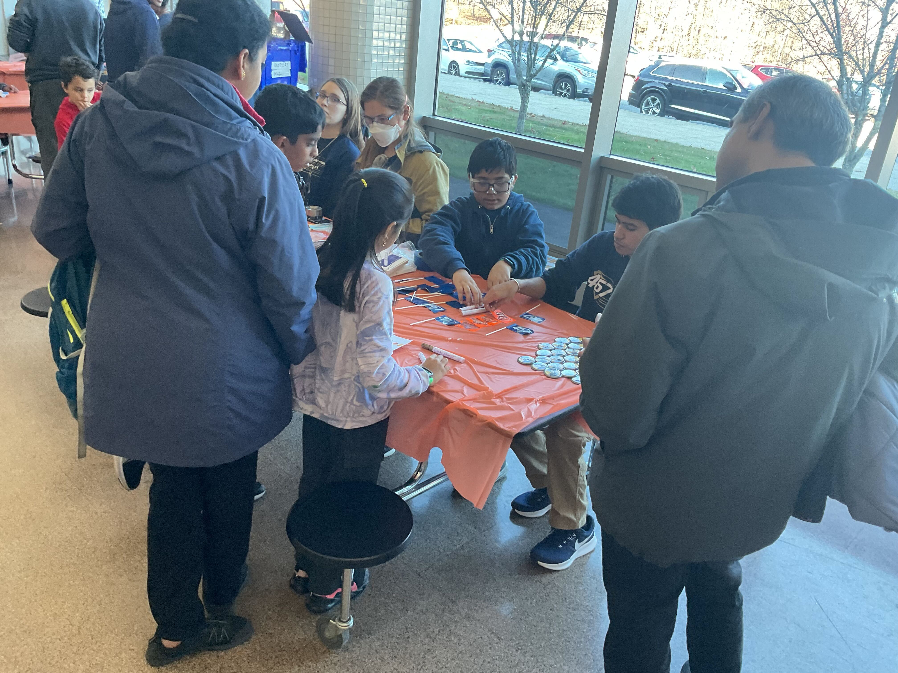



Our open house is a great way to connect, especially with the younger members of our Shrewsbury community, while promoting our team and showcasing our robot! Visitors are able to engage in various STEM activities, and witness the robot in action. We do this to raise awareness within our community about STEM and offer opportunities for our community to get involved with our other related initiatives like our fall FLL program and our STEM summer camp. In addition to our fun games and robot demonstrations, we put up displays of each of the main subteams from our high school robotics team: Programming, Electrical, Mechanical, and Outreach.





---





These displays are run by our experienced members who give insight to what goes on in their sub team and how they fit into the robot design process.

It wouldn't be an open house if we didn't also give a tour of our shop which houses our Mill, Lathe, CNC router, and 3D printers; which allow us to do almost all of our machining in house.

Robots, fun STEM activities, and informative stations combine together to make a passport which kids fill out as they go around to each station. Once they complete their passport they return to the front to receive a special prize!



---

This years open house will be held on November 2nd 2025.

This video is from last year and will provide some insights into this years event:



