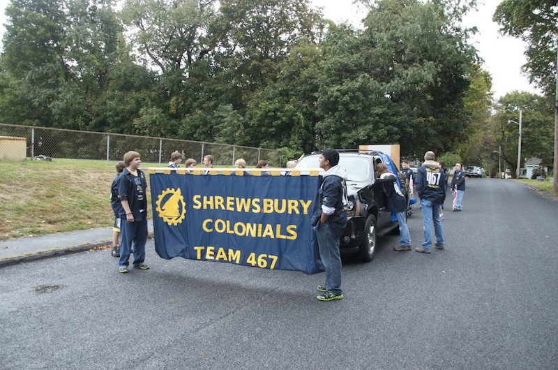

Every year as the leaves change color, Team 467 attends the Annual [Spirit of Shrewsbury](https://www.shrewsburyfallfestival.org/) (S.O.S.) Fall Festival. This festival allows members of the Shrewsbury community to enjoy and learn about many of the town’s schools, clubs and organization. Our team has attended and participated since our founding, allowing the community to experience what we are all about and spread the message of [FIRST](http://www.firstinspires.org/robotics/frc) and [STEM](https://en.wikipedia.org/wiki/Science,_Technology,_Engineering,_and_Mathematics).

This event is extremely important to us, simply because of the publicity and the outreach that it enables. Our robots march in the parade, showing off their talents along the way. Also, we give interviews for the local TV station, talk to parents about the programs we offer, and teach any curious people, regardless of age, a little bit about who we are. This is our way to reach the biggest number of people, as expo and parade participants come from all over our region for the fun.

Joins us for a great day while we spread the message and ideals of and Shrewsbury Robotics to encourage younger members of the community to enjoy science, technology and engineering.. We will have our competition robot from last year on display.

