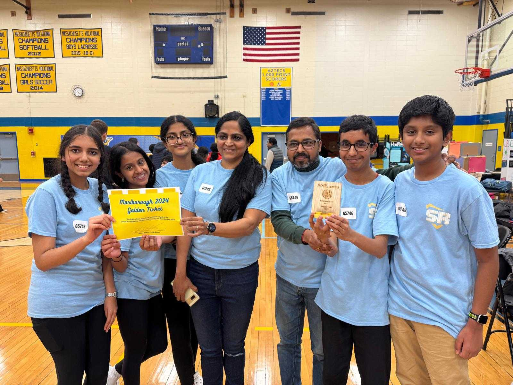

Team 14 attended the Marlborough qualifiers and we qualified to go to the states. We also won an innovation project award.

I thank all the Shrewsbury Robotics organizers for their invaluable help and guidance during the mock competitions and outside of it. Without their support we wouldn't have improved our project, robot design and our game. One lesson we learned during the competition is to teach your kids to review the robot game rubrics carefully and to discuss any discrepancy with the judges respectfully. They were able to point out the gaps and get the scores. I wish all the team the very best for the upcoming qualifiers. Go Shrewsbury!

