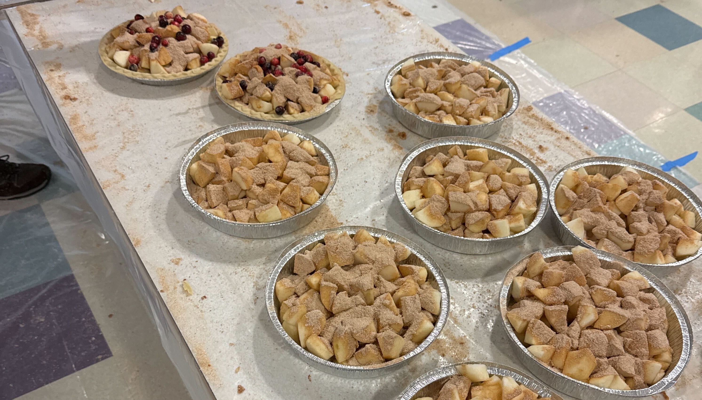
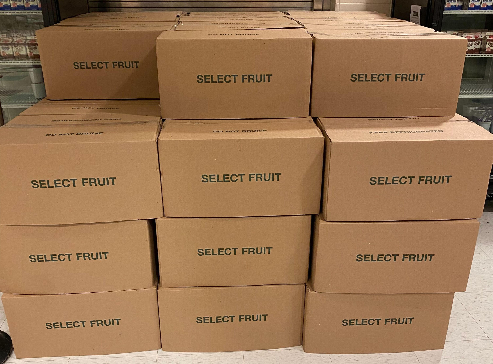
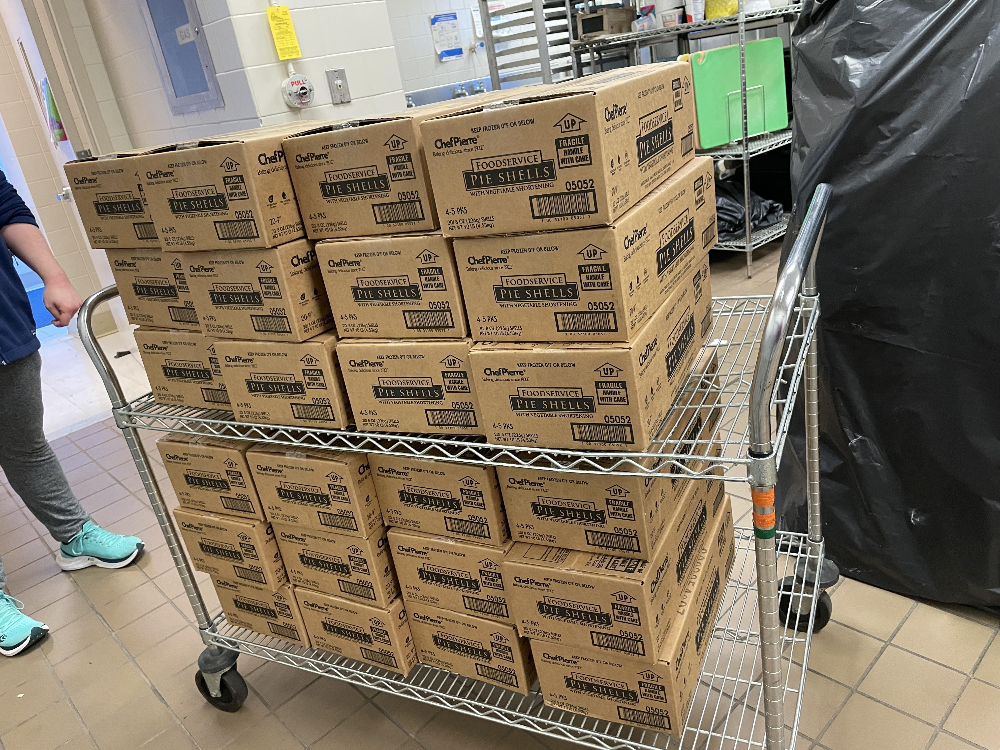

The weekend before Thanksgiving, FRC Team 467: **Center of Mass** proudly hosted our **22nd Annual** Thanksgiving Pie Bake! This longstanding tradition has been a cherished part of our team’s culture, bringing together students, mentors, parents, and supporters to not only serve our local community but also give back in meaningful ways. Over the years, it has grown into a smooth operation and a heartwarming way to celebrate the season of giving.

This year, we set out with ambitious goals, and thanks to the dedication of our team and volunteers, we achieved a record-breaking total of **640 Apple Crumb Pies** and **70 Apple Crisps** baked and ready for delivery. While many of these pies went to community members who bought the pies in the prior month, a significant portion was donated to [Veterans Inc.](https://www.veteransinc.org/)







The big day started at **6:30 AM** as students, mentors, and parents met at the **Oak Middle School Cafeteria**, ready to roll up their sleeves and dive into the pie-making process. It wasn't long before the cafeteria was filled with peeling and chopping apples. The whole process was well-planned, right from the assembling of each pie to baking, such that at every station, the teams moved around the workflow in a smooth, proficient manner.

Of course, the event didn’t come together overnight. Planning for the Pie Bake began weeks in advance, with mentors coordinating everything from ingredient sourcing to logistics. In the days leading up to the event, mentors worked tirelessly to gather the necessary materials. This included acquiring 50 bushels of fresh apples from [Flat Hill Orchards](https://www.flathillorchards.com). Along with hundreds of pie shells, bags of sugar, spices, and other essentials, the ingredients were carefully organized and prepped to ensure the big day went off without any problems.







This event is more than just a fundraiser or community service initiative—it’s a celebration of teamwork, dedication, and the spirit of giving. It’s an opportunity for everyone involved to come together and make a tangible difference. Beyond the financial support this event generates for our robotics program, it strengthens our bond as a team and reinforces our mission to contribute positively to the world around us.
