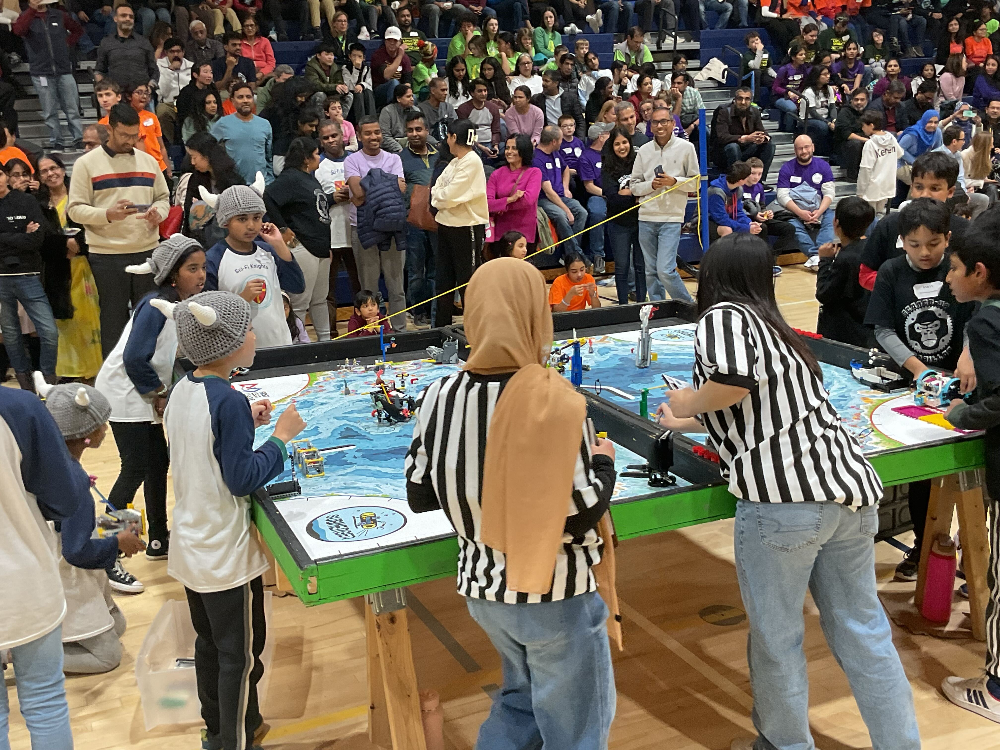

On Saturday, December 7, our team hosted our **17th Mindstorm Mayhem** qualifier. It was an exciting event, allowing young creators to compete on a local level while still being exposed to a competitive environment.

With an incredible turnout of nearly 36 teams, we were able to provide the students with a fun and challenging competition.

In addition, two former FLL members reunited with MC King and took a picture to celebrate as seen below. With smiles all around, our team members created new connections making a truly memorable occasion. As always, we can’t wait for the next time we host Mindstorm Mayhem. See you there!

