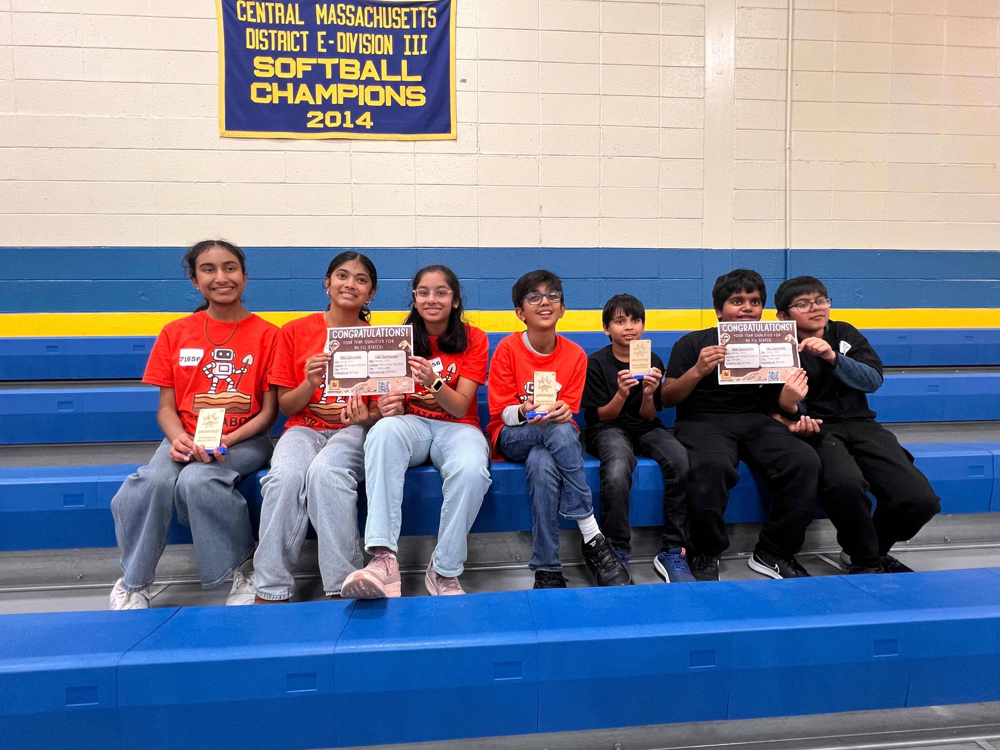
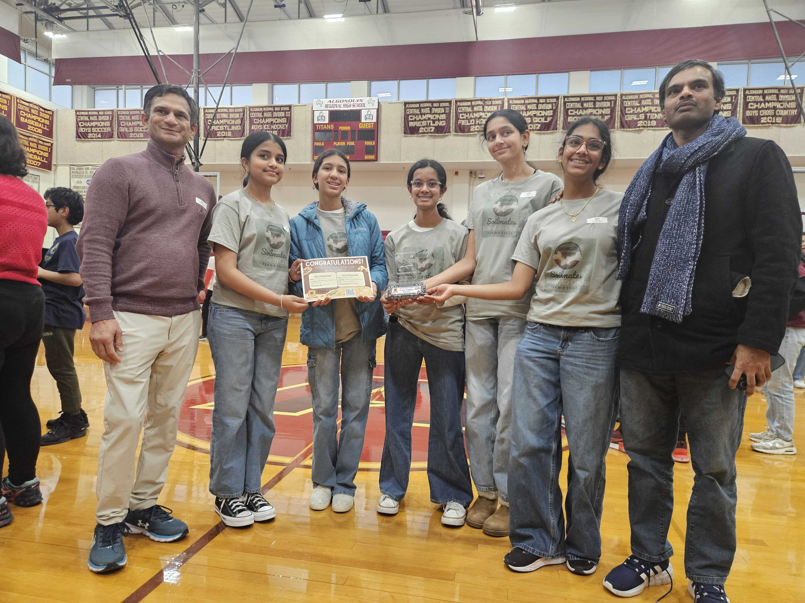
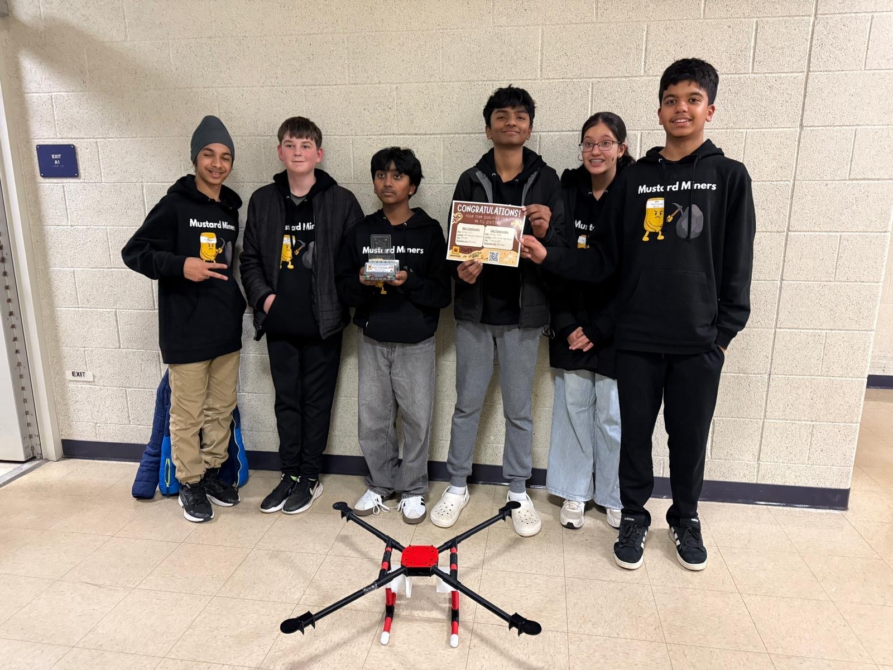
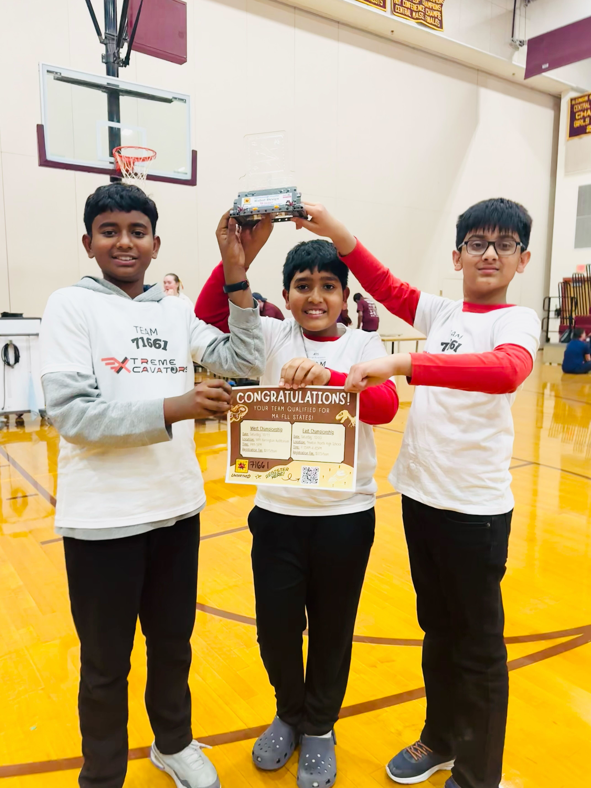
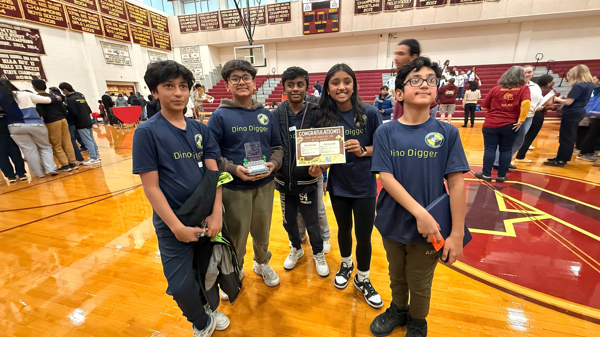
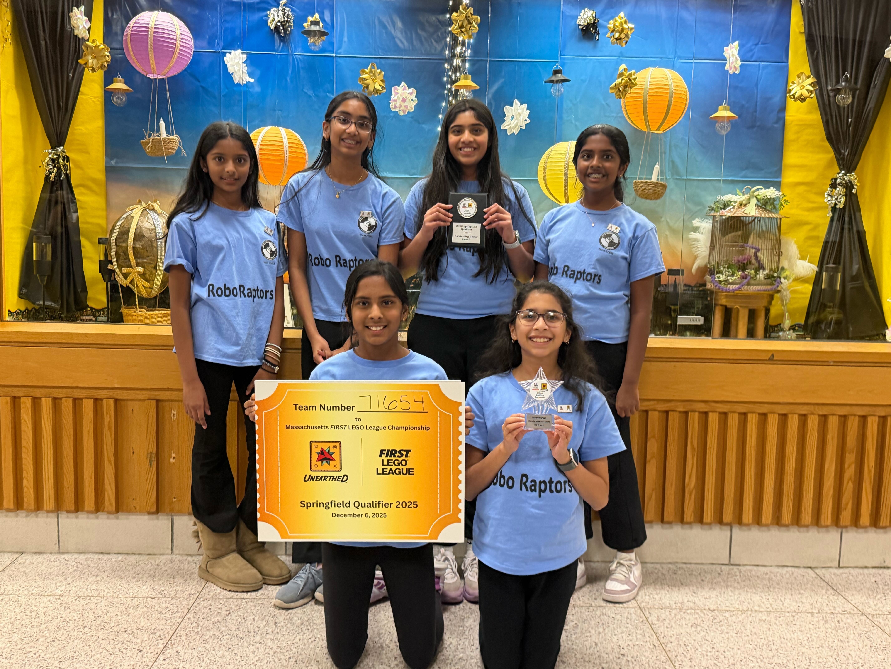
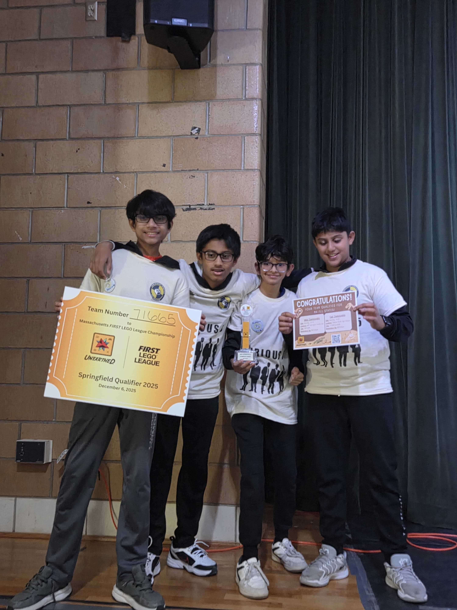
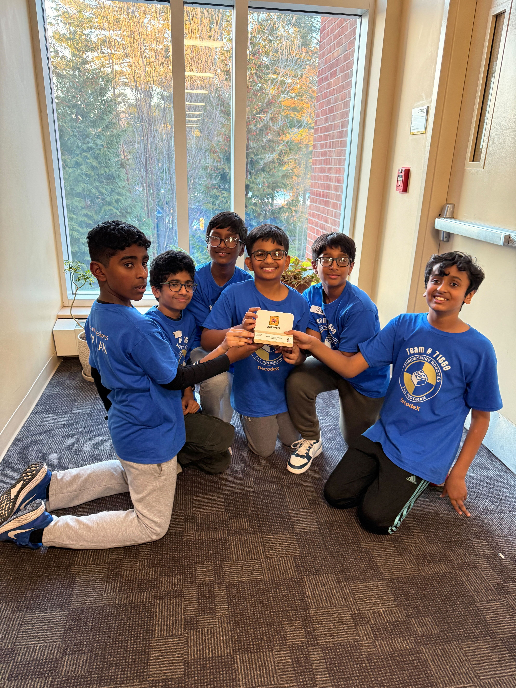
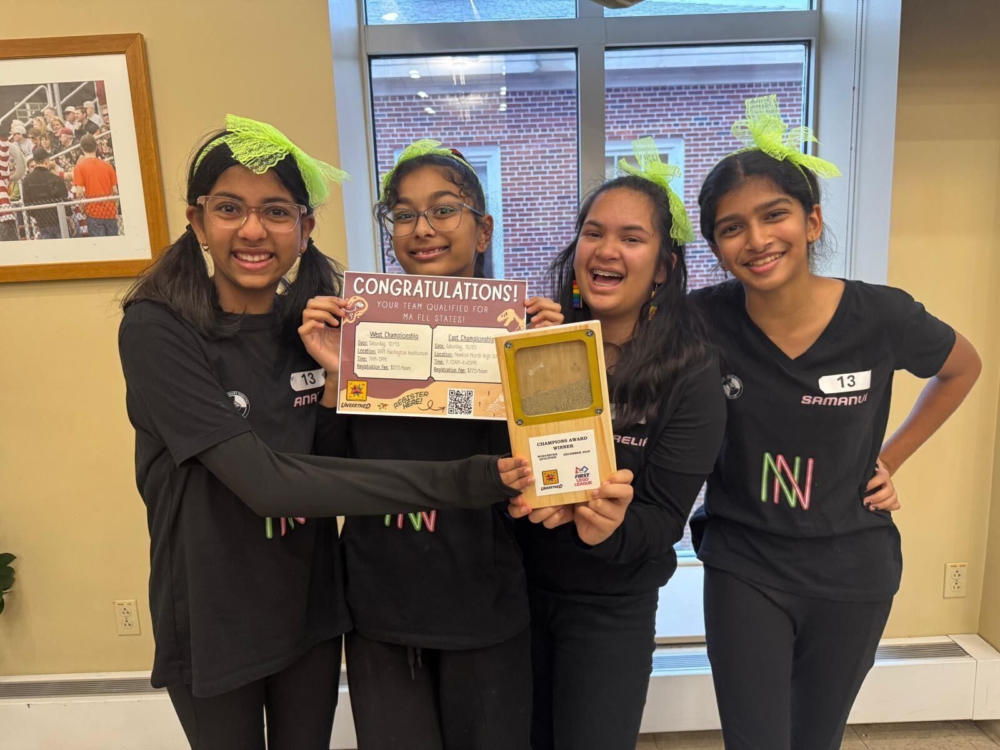
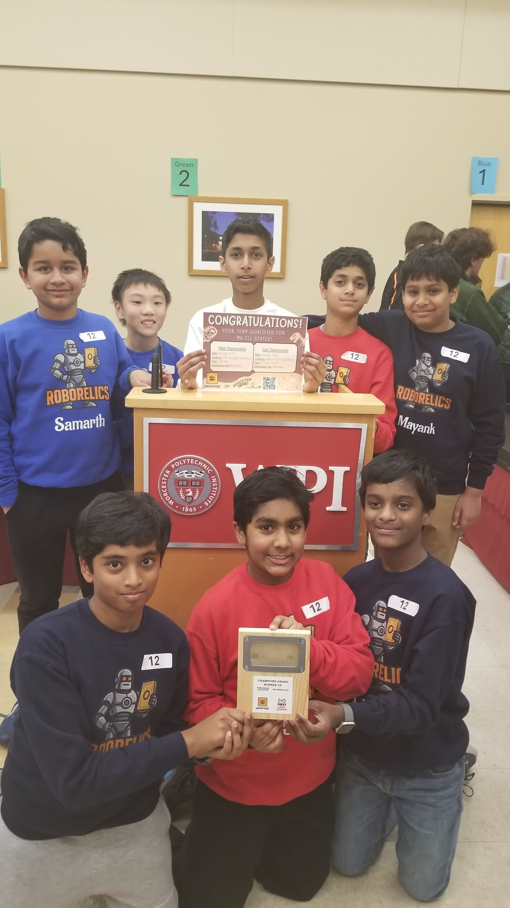

Since August, our FIRST LEGO League (FLL) teams have been on an incredible journey of late-night brainstorming, complex coding, and precision engineering! All those hours spent perfecting innovation projects and fine-tuning robots have led to this moment.  
We are beyond ecstatic to announce that **12 of the 21 Shrewsbury Robotics teams** have officially punched their tickets to the **State Championship**!  
Congratulations to all the teams that made it to the state competition. This is a monumental achievement this is a monumental achievement that speaks to your grit, creativity, and teamwork. To every student who competed: we are bursting with pride at what you’ve accomplished.


  
    
  Team Stratabots 1st Place Core Values Coach Award

  
    
  Cold Agent Rising All Star


<h3 style="text-align:center;">Northborough Qualifiers</h3>


  
    
  Team SoilMates 1st Place Core Values
  
    
  The Mustard Miners 3rd Highest Match Score



  
    
  Team Xtreme Xcavators 1st Place Core Values

  
    
  Dino Diggers 2nd Place Core Value Award



<h3 style="text-align:center;">Springfield Qualifiers</h3>


  
    
  Robo Raptors 1st Place Innovation Project Coach Award

  
    
  Furious 5 1st Place Champions Award



<h3 style="text-align:center;">WPI 1 Qualifiers</h3>


  
    
  Ancient Architects 1st Place Robot Design
 

  
    
  Groundbreakers Judges Award Core Values


<h3 style="text-align:center;">WPI 2 Qualifiers</h3>


  
    
  Neon Nerdetts 1st Place Chamionship Award

  
    
  Robo Relics Judges Award Core Values

