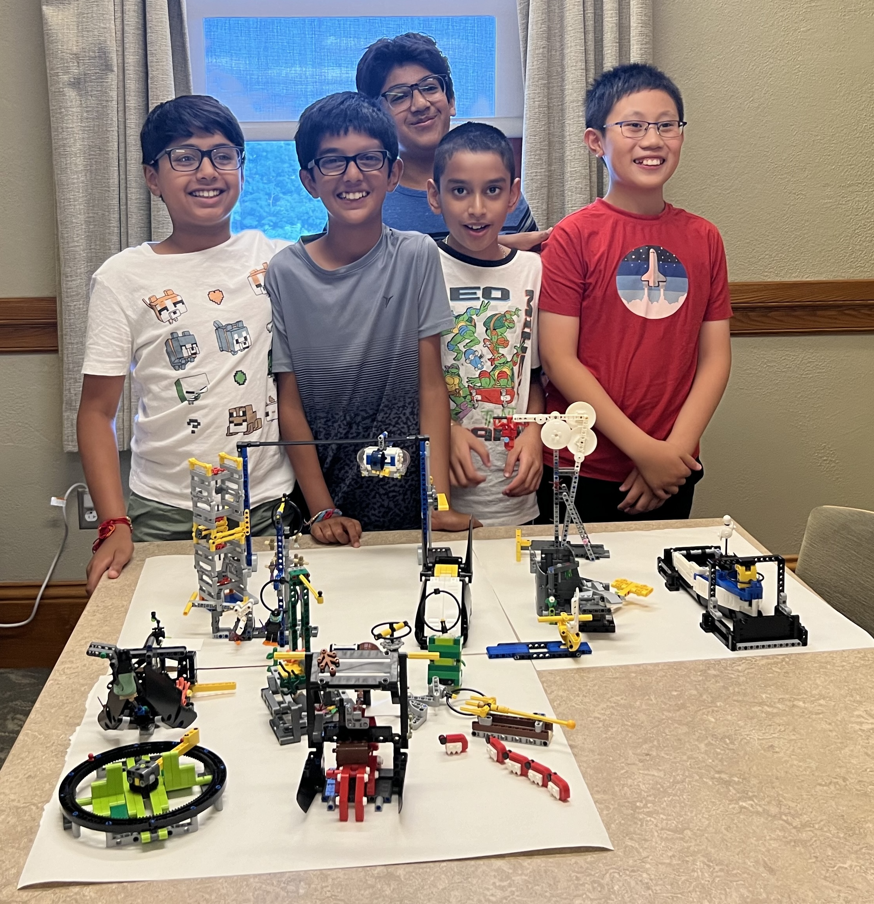



[**_FIRST_ LEGO League**](https://www.firstinspires.org/robotics/fll/what-is-first-lego-league) introduces science, technology, engineering, and math (STEM) to children ages 4-16 through fun, exciting hands-on learning. Participants gain real-world problem-solving experiences through a guided, global robotics program, helping today’s students and teachers build a better future together.

_FIRST_ LEGO League has three divisions that inspire youth to experiment and grow their critical thinking, coding, and design skills through hands-on STEM learning and robotics.





---

**Shrewsbury Robotics** currently offers two programs based on the **_FIRST_ LEGO League Challenge**, aimed at students in middle school grade 5-8:
* [Fall Program]()
  * Students compete in the annual **_FIRST_ LEGO League Challenge** competition
* [Summer Program]()
  * Fun informal summer vacation program based on the previous years challenge.

We also host the largest _FIRST_ LEGO League qualifying event in Massachusetts - [Mindstorm Mayhem]().

### _FIRST_ LEGO League Challenge:
Friendly competition is at the heart of Challenge, as teams of students in grades 5-8 engage in research, problem-solving, coding and engineering – building and programming a LEGO robot that navigates the missions of a robot game. As part of Challenge, teams also participate in a research project to identify and solve a relevant real-world problem.

#### Example Challenge from the 2024 competition season - SUBMERGED
