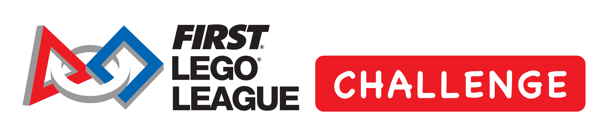

## _FIRST_® LEGO® League Challenge

**_Shrewsbury Robotics_** is pleased to be offering the  **_FIRST_ LEGO League Challenge** program in fall of 2024 (August-December) for students attending **_Sherwood Middle_** and **_Oak Middle_** Schools in Shrewsbury.

---

## Welcome to the SUBMERGED Season



### Explore the Future

In the [**SUBMERGED℠**](https://www.firstinspires.org/resource-library/fll/challenge/challenge-and-resources) challenge, FIRST® LEGO® League teams will use creative thinking and LEGO® technology to explore the layers of the ocean and bring their learnings and ideas to the surface as they “sea” into the future





---



---

## Shrewsbury Robotics Program
### Update for returning Shrewbury Robotics students & parents

We have made a number of changes to the program for the 2024 season. These changes includes a new start date which now aligns with the  _FIRST_ release date for the program in August.

We also expect parents/guardians to be the primary team coaches. Student team members will be formed into teams which will primarily mentored and supervised by coaches comprised of their own guardians. This change allows Shrewsbury Robotics to help more teams and as such will make the program far more sustainable.

---

### Program Timeline

* **June** – informational meeting for students and parents interested in signing up. Notifications will be sent out via:
  * Each school Principals' email to parents
  * Community Bulletins
  * Shrewsbury Robotics Facebook page.
* **June** – Signup.
* **July** – team formation.
* **August** - New challenge/competition is released early August (2024 was 8/6)
* **August** - Materials can be preordered and will be delivered starting beginning August, but instructions will not be provided until release date. Materials can only be purchased for fully paid up teams, consequently teams need to be formed before start of August to go through payment process and ordering.
* **August** through **December**
  * Teams meet 2 to 3 times weekly.
  * Regular help sessions from Shrewsbury Robotics.
  * Mock competitions late **October** and early **November**.
* Late **November** to early **December** – qualifying competition.
* Mid/late **December** – Massachusetts District Competition.
* **April** – World Championship

---

### Role of Team Coaches

Parents or Guardians volunteering to be the coach for their students team do not need any prior experience. The key requirement is a willingness to support the team and foster enthusiasm in the team members.



**Students are expected to learn and do the work themselves**. This is an important part of the program. When students discover information themselves they will remember it better and be more skilled at it next time. In many instances as Coach, you will be learning new skills alongside the students.

We need volunteers for each team as we can only support as many teams as we have coaches!

Each team must have 2 official _FIRST_ Lead Coaches. There are also plenty of other support activities for other guardians to do. When you sign up your student please make sure you indicate if you are willing to be a Lead Coach.





To ensure the safety of our students, all adults working with students in this program should meet the following requirements:
* Obtain a CORI check through Shrewsbury Public Schools
* Be fingerprint checked through IdentoGo
* Submit for a Youth Protection Policy check through _FIRST_.
* Minimum of 2 adults who have met these checks to be present every time the team meets.  These do not have to be the Lead Mentors.

---

### Role of Shrewsbury Robotics
Shrewsbury Robotics has many years experience running _FIRST_ LEGO League programs which we are happy to share:
* Providing training and advice to coaches
* Access to our [**slack**](https://slack.com) FLL channel so you can ask questions and get answers in a timely fashion.
* Host regular sessions for teams to get advice or help.
* Run mock **competitions** and **judging** sessions for our teams.
* Arrange opportunities for teams to share their projects and get feedback. This is an important aspect of project work.

We are very excited with this new program model and really look forward to being involved with the middle schoolers again.

---

### Sign Up Information
There have been a few requests for information on how to sign up for LEGO Robotics 2024. Unfortunately, the program is currently full. Please look for the informational meeting and signup information for the 2025 competition in **June 2025**.

Please direct any questions to fll@shrewsburyrobotics.org
