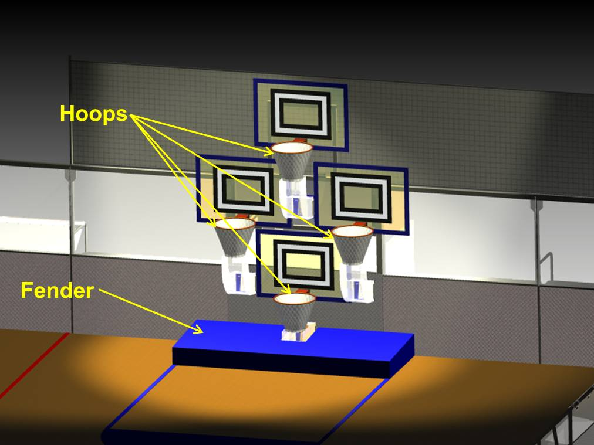
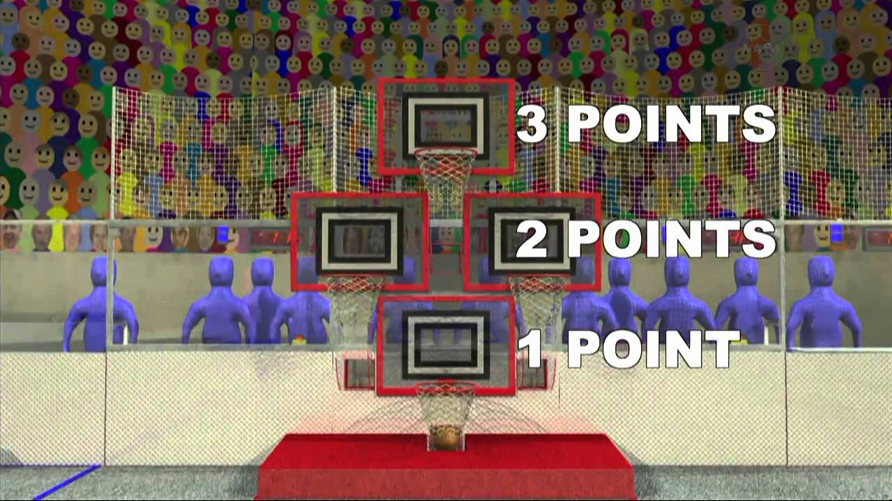

Rebound Rumble is played by two competing Alliances on a flat, 27 x 54 foot field. Each Alliance consists of three robots. They compete to score as many basketballs into their hoops as they can during a 2 minute and 15 second match. The higher the hoop in which the basketball is scored, the more points the Alliance receives. The match begins with a 15-second Hybrid Period in which robots operate independently of driver inputs. During this Hybrid Period, one robot on each Alliance may be controlled using a Microsoft Kinect. Baskets scored during this period are worth extra points. For the remainder of the match, drivers control robots and try to maximize their Alliance score by scoring as many baskets as possible.

|  |  |
|---|---|

The match ends with robots attempting to balance on bridges located at the middle of the field. In Qualification Matches, a robot from each Alliance will also try to balance on the white Coopertition bridge to score additional ranking points for each Alliance. Scoring for the match is summarized below.

Watch the FRC 2012 Rebound Rumble Game Animation


