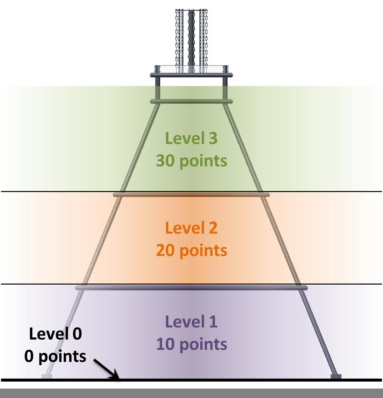
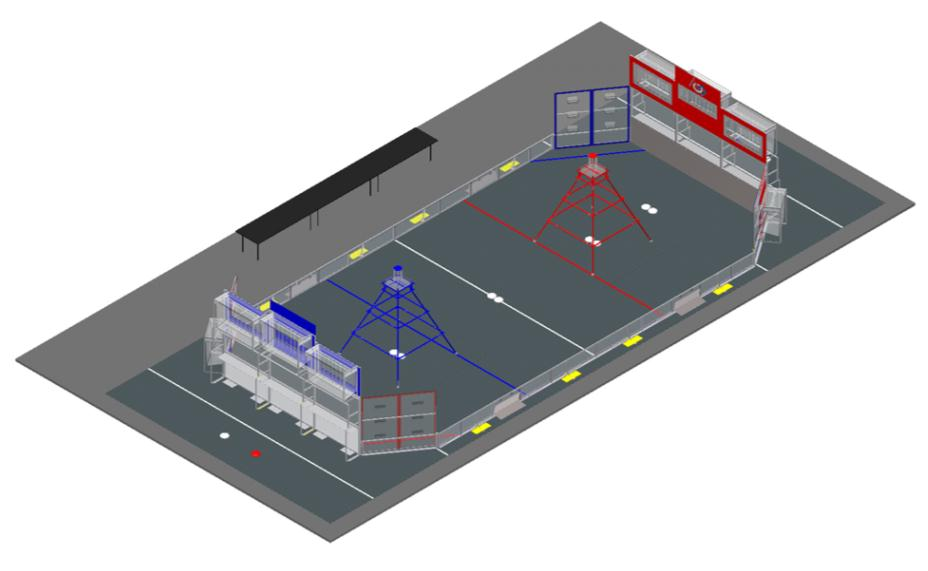

ULTIMATE ASCENT is played by two competing alliances on a flat, 27 x 54 foot field. Each Alliance consists of three robots, and they compete to score as many discs into their goals as they can during a two (2)-minute and fifteen (15)-second match. The higher the goal in which the disc is scored, the more points the Alliance receives.

The match begins with a fifteen (15)-second Autonomous Period in which robots operate independently of driver inputs. Discs scored during this period are worth additional points. For the remainder of the match, drivers control robots and try to maximize their alliance score by scoring as many goals as possible.

The match ends with robots attempting to climb up pyramids located near the middle of the field. Each robot earns points based on how high it climbs. Scoring for the match is summarized below.

Watch the FRC 2013 Ultimate Ascent Game Animation


