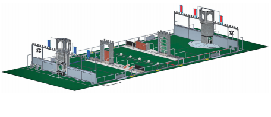

**FIRST STRONGHOLD** is played by two alliances of three teams each. Alliances compete against each other to breach their opponents’ defenses, known as outer works, and capture their tower. They score points by crossing elements of their opponents’ outer works, scoring boulders in their opponents’ tower goals, and surrounding and scaling their opponents’ tower itself. First Stronghold is played on a 27 ft. by 54 ft. field. Each alliance commands one tower, five defenses, and a ‘secret passage’ which allows their robots to restock on ammunition, called boulders.

Robots operate independently for the first 15 seconds of the Quest. Alliances score points by, reaching opponents defense, crossing defenses, and scoring boulders through goals in the opposing tower. Human drivers take control for the first 2 minutes and 15 seconds, controlling their robot to, defend their castle, defeat defense, score goals from the opponents’ courtyard in tower, and capture and scale the opponent’s tower.

The Outer Works are composed of eight defensive options and over 18,000 possible field configurations. There is one permanent defense, the the low bar, one chosen periodically by the audience, and three selected by Alliances just before each Quest begins. Once the Quest begins illuminated lights on each defense reduce when an opposing robot full crosses it for the first time. These lights go dark after the defense hall has been crossed for a second time, signaling it’s considered damaged. Once any four of the five defenses are damaged, the fortifications are considered breached and the charging Alliance is rewarded with points.

The Tower has openings which are available for the robot to score boulders. Scoring boulders reduces the tower’s strength as indicated by decreasing tower lights. The tower’s flag will drop when enough boulders are scored and then the tower can be captured at the end of the quest

The Capture of the tower can occur during the last 20 seconds of the Quest; robots may surround and scale the tower to capture it. When capture is successful, their flag is raised on the opposing tower and even more points are earned. The Alliance with the highest score at the end of the Quest wins!

To see the official game animation for the 2016 FIRST Robotics Competition game click here:



