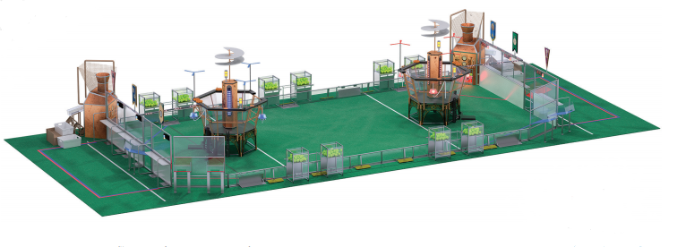

*FIRST*® STEAMWORKS the 2017 *FIRST* Robotics Competition game, invites two adventure clubs from an era in which technology relied on steam power to prepare their airships for the ultimate long distance race.

**Each three-team alliance prepares to take flight in three ways:**

1. **Build Steam Pressure.** Robots collect fuel represented by green balls. They score it in high and low goals in their boiler. As fuel is scored steam pressure in the tank on the alliance’s airship builds – the high goal builds pressure faster than the low goal.
2. **Start Rotors.** Robots retrieve and deliver gears to pilots on their airship who then install them on the appropriate rotor. Once a gear train is complete the rotor can be started.
3. **Prepare for Flight.** Adventure clubs want their robots to climb aboard their airships so they can assist the pilots during the race.

**Autonomous Period:**

Robots operate independently from preprogrammed instructions for the first 15 seconds.

Adventure clubs score points by:

- Reaching their baseline
- Delivering gears to the airship
- Scoring fuel into the boilers

**Teleoperated Period:**

Operators take control for the final two minutes and fifteen seconds.

Adventure Clubs continue to score points by:

- Collecting and delivering gears to their airship
- Scoring fuel in the boilers
- Climbing the ropes on their airship to prepare for flight
- Populating gear trains to start rotors
- Defending against other Adventure Clubs

**The adventure club with the highest score at the end of the match is best prepared for the race and wins.**

To see the official game animation for the 2017 FIRST Robotics Competition game click here:



