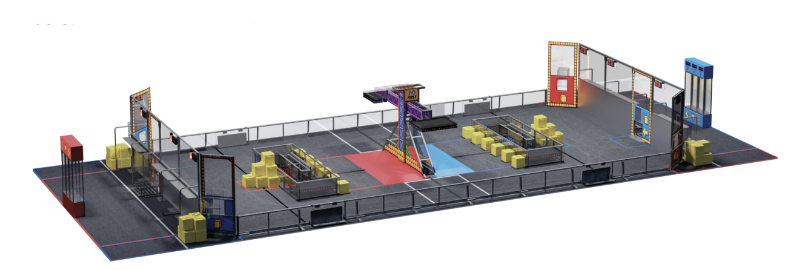

### FIRST ® POWER UP, SM the 2018 FIRST ® Robotics Competition game, finds our teams trapped in an 8bit video game! Teams use power cubes to defeat the boss

Watch the official game animation for the 2018 FIRST Robotics Competition game:



**Each three-team alliance has three ways to help defeat the boss:**

1. Owning the scale or their switch. Ownership occurs when the scale or alliance’s switch is tipped in their favor. Robots collect and deliver power cubes to gain ownership.
2. Playing power ups. Alliances exchange power cubes for power ups. Power ups provide a timed advantage during the match. There are three power ups that can be played: Force, Boost, and Levitate.
3. Climbing the scale tower. Robots work together to climb the scale tower to face the boss.

**Autonomous Period:**

Robots operate independently following preprogrammed instructions for the first fifteen seconds of the match.

Alliances score points by:

- Reaching their own autonomous line
- Gaining ownership of the scale or their switch

**Teleoperated Period:**

Operators take control for the final two minutes and fifteen seconds of the match.

Alliances continue to score points by:

- Gaining ownership of the scale or their switch
- Delivering power cubes to the alliance’s vault
- Using power ups for a timed advantage
- Parking on the scale platform or climbing the scale to face the boss

**The alliance with the highest score at the end of the match defeats the boss and wins.**