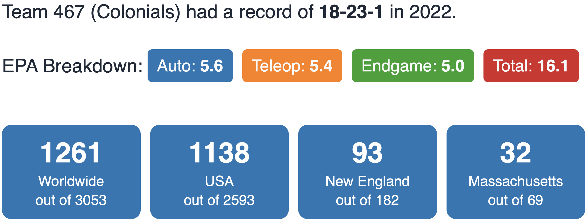



### Robot





### Competitions

---

#### Regular Season

* [Granite State](https://www.thebluealliance.com/event/2022nhgrs)
  * _District Chairman's Award_
* [Western NE](https://www.thebluealliance.com/event/2022mawne)
  * _Judges' Award_
* [District Championship](https://www.thebluealliance.com/event/2022necmp2)

#### Post Season

* [Battlecry](https://www.thebluealliance.com/event/2022bc)

---



---

### The Game



In **_RAPID REACT_**, two competing alliances are invited to process cargo for transportation. Each alliance is assigned a cargo color (red or blue, based on alliance affiliation) to process by retrieving their assigned cargo and scoring it into the hub. Human players assist the cargo retrieval and scoring efforts from within their terminals. In the final moments of each match, alliance robots race to engage with their hangar to prepare for transport!





---



