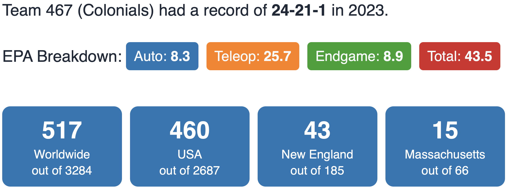



### Robot





### Competitions

---

#### Regular Season

* [Granite State](https://www.thebluealliance.com/event/2023nhgrs)
* [Western NE](https://www.thebluealliance.com/event/2023mawne)
  * Creativity Award sponsored by Rockwell Automation
* [District Championship](https://www.thebluealliance.com/event/2023necmp2)
  * District Championship Finalist

#### Post Season

* [Battlecry](https://www.thebluealliance.com/event/2023bc)
* [NERD](https://www.thebluealliance.com/event/2023matb)
  * Finalist

---



---

### The Game



In **_CHARGED UP_**, two competing alliances are invited to process game pieces to
bring energy to their community. Each alliance brings energy to their community by retrieving their game
pieces from substations and scoring it into the grid. Human players provide the game pieces to the
robots from the substations. In the final moments of each match, alliance robots race to dock or engage
with their charge station!



)



---



