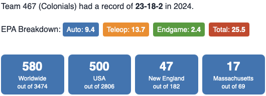



### Robot





### Competitions

---

#### Regular Season

* [BSU](https://www.thebluealliance.com/event/2024mabri)
  - _Dean's List Semi-Finalist (Akhil N)_
* [Western NE](https://www.thebluealliance.com/event/2024mawne)
* [District Championship](https://www.thebluealliance.com/event/2024necmp2)

#### Post Season

* [Battlecry](https://www.thebluealliance.com/event/2024bc)
* [NERD](https://www.newenglandroboticsderby.com)

---



---

### The Game



)



In [**_Crescendo_**](https://en.wikipedia.org/wiki/Crescendo_(FIRST)), two competing alliances are invited to score notes, amplify their speaker,
harmonize onstage, and take the spotlight before time runs out. Alliances earn additional rewards for meeting
specific scoring thresholds and for cooperating with their opponents.



---



---

### Season Recap Video

