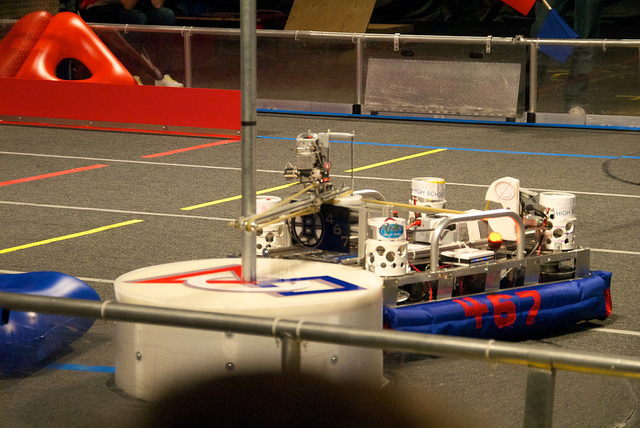
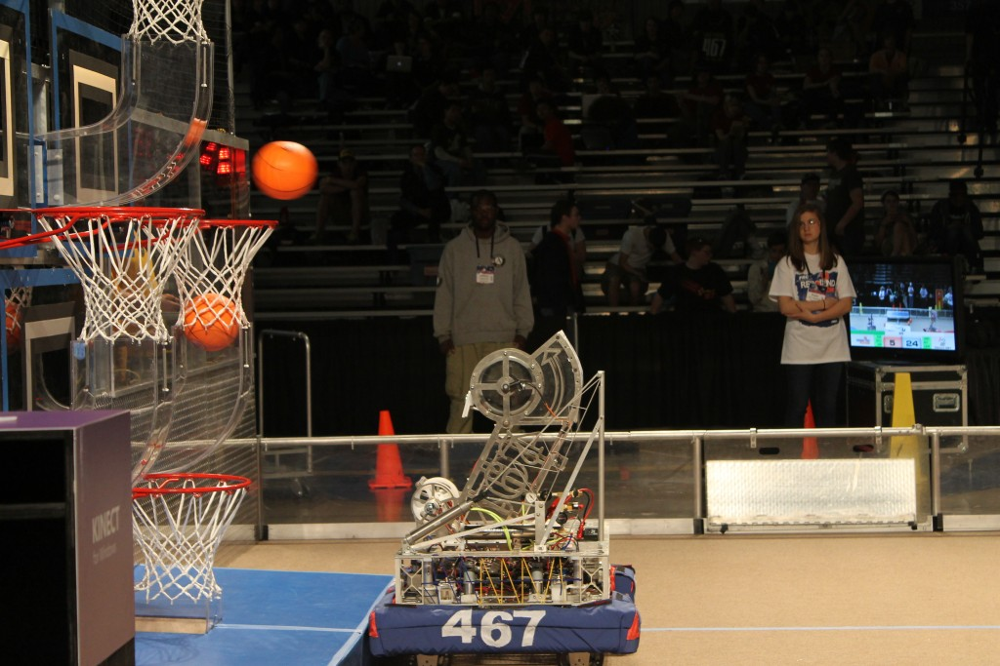





This program is open to any High School student who attends Shrewsbury High School and is in good academic standing. The team competes in the annual FIRST Robotics competition, an international high school competition.



The team is led by student leaders, industry engineers, parents, and community members. An engineering committee consisting of mentors and engineering sub-team student leaders direct the creation of the robot throughout the build season. After the robot is complete, the team travels to two regional competitions; these usually occur in March and early April. During the year, the team participates in many team building, and community building events.

### FIRST Encourages students to engage in:



“The varsity Sport for the Mind,” FRC combines the excitement of sport with the rigors of science and technology.  
Under strict rules, limited resources, and time limits, teams of 25 students or more are challenged to raise funds, design a team “brand,” hone teamwork skills, and build and program robots to perform prescribed tasks against a field of competitors.









It’s as close to “real-world engineering” as a student can get. Volunteer professional mentors lend their time and talents to guide each team.



*Students get to:*

- Learn from professional engineers
- Build and compete with a robot of their own design
- Learn and use sophisticated software and hardware
- Compete and cooperate in alliances and tournaments
- Earn a place in the World Championship
- Qualify for nearly $25 million in college scholarships

