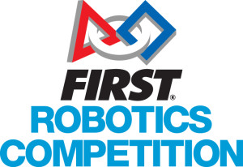





[_FIRST_ Robotics Competition (FRC)](https://www.firstinspires.org/robotics/frc) is an international high school robotics competition.

Each year, teams of high school students, coaches, and mentors work during a six-week period to build robots capable of competing in that year's game.



---

**FRC Team 467: Colonials** is The Shrewsbury High School robotics team that competes in _FIRST_ Robotics. We have competed every year since our rookie season in 2000.

This program is open to any High School student who attends Shrewsbury High School and is in good academic standing.

The team is led by student leaders, industry engineers, parents, and community members. An engineering committee consisting of mentors and engineering sub-team student leaders direct the creation of the robot throughout the build season which starts in early January.

After the robot is complete, the team competes in at least two district competitions; these usually occur in late February, through March. If eligible, we also compete in the **New England District** and **World Championship** competitions.

Throughout the year, the team also actively works to support the [mission of _FIRST_](https://www.firstinspires.org/about) through outreach and participation in many team  and community events.

---

### Experience a _FIRST_ Robotics Competition

The best way to experience _FIRST_ Robotics is to attend a [local competition](https://www.nefirst.org/district-events). All events are free and open to the public.

Alternatively, you can gain some understanding by watching many of the matches available on YouTube.

For example, here is Team 467 competing in the semi final at our first 2024 season event:



... and for comparison, here are the best robots in the world competing in the final match from the **2024 World Championship**:



---

### Gracious Professionalism

A key element of competing in _FIRST_ Robotics is the concept of [Gracious Professionalism](https://www.firstinspires.org/node/20891) first coined by one of the founders of _FIRST_; [Dr. Woodie Flowers.](https://www.firstinspires.org/about/leadership/dr-woodie-flowers)

**FRC Team 467: Colonials** embraces Gracious Professionalism and applies it to all aspects of our team and community.

---

### Student Benefits

In addition to the fun of participating in _FIRST_ Robotics Competition, students also gain the following:

* Learn real-world **mechanical engineering**, **manufacturing**, **electronics** and **programming** skills from professional engineers
* Build and compete with a robot of their own design and manufacture
* Learn to use modern, complex software and hardware in an integrated system
* Compete and cooperate with their peers in alliances and tournaments
* Work to earn a place in the District and World Championships
* Qualify for some of the millions of dollars available in [college scholarships](https://www.firstinspires.org/alumni/scholarships)

