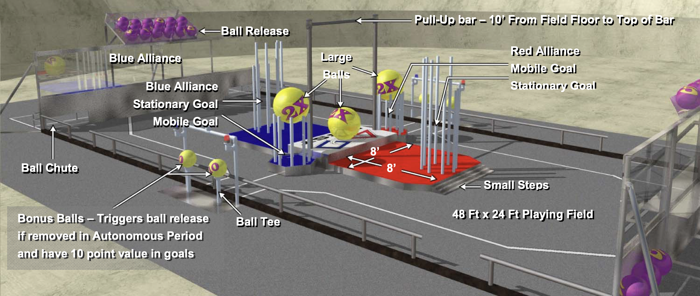
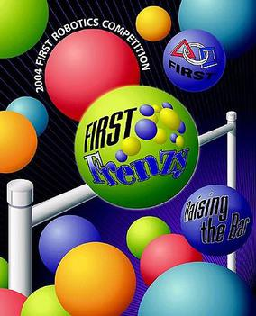



### Robot

---





### Competitions

---

#### Regular Season

* [Granite State Regional](https://www.thebluealliance.com/event/2004nh)
* [Long Island Regional](https://www.thebluealliance.com/event/2004li)
  * _DaimlerChrysler Team Spirit Award_

#### Post Season

* [Battlecry](https://www.thebluealliance.com/event/2004wpi)

---





---

### The Game

The object of the game is to attain a higher score than your opponent alliance by delivering balls into goals,
capping goals with larger balls, and/or having robots hanging from the Pull-Up Bar at the end of the round of
competition.

---









---

### Team Photo


---

