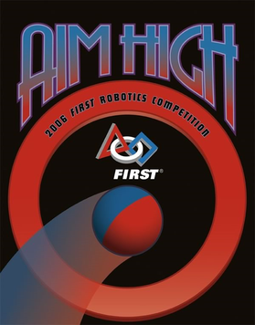

# 2006: Aim High

---



### Robot: ARCHIMEDES

---





### Competitions

---

#### Regular Season

* [Finger Lakes Regional](https://www.thebluealliance.com/event/2006roc)
  * _Creativity_
* [Boston Regional](https://www.thebluealliance.com/event/2006ma)
  * _Delphi "Driving Tommorow's Technology" Award_

#### Post Season

* [Battlecry](https://www.thebluealliance.com/event/2006wpi)

---





---

### The Game

AIM HIGH is a game played on a field as illustrated in the figure below. Two alliances, one red and one blue,
composed of three teams each, compete in each match. The object of the game is to attain a higher score than
your opponent alliance by scoring balls in the center or corner goals, and/or by having ROBOTs on your
platform or ramp at the end of the match.

---









---

### Team Photo


---

