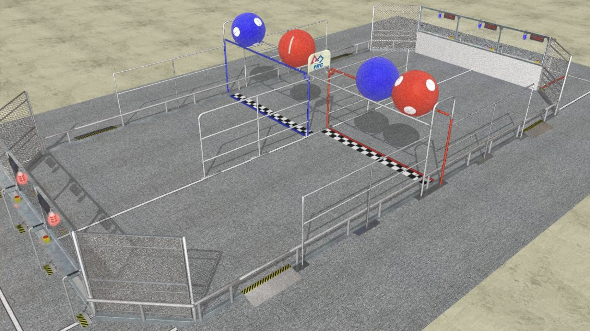

# 2008: _FIRST_ Overdrive

---



### Robot: ROXANNE

---





### Competitions

---

#### Regular Season

* [Connecticut Regional](https://www.thebluealliance.com/event/2008ct)
  * _Judges Award_
* [Philadelphia Regional](https://www.thebluealliance.com/event/2008pa)
  * _Judges Award_

#### Post Season

* [Battlecry](https://www.thebluealliance.com/event/2008wpi)

---





---

### The Game

_FIRST_ Overdrive is a game played on the TRACK (illustrated in the figure below). Two
ALLIANCES, one red and one blue, composed of three teams each, compete in each MATCH. The
object of the game is to attain a higher score than your opponent by making counter-clockwise laps
with your robot around the TRACK while moving large TRACKBALLS over and/or under the
OVERPASS that bisects the TRACK. The point values for each of those actions are explained
below.

---









---

