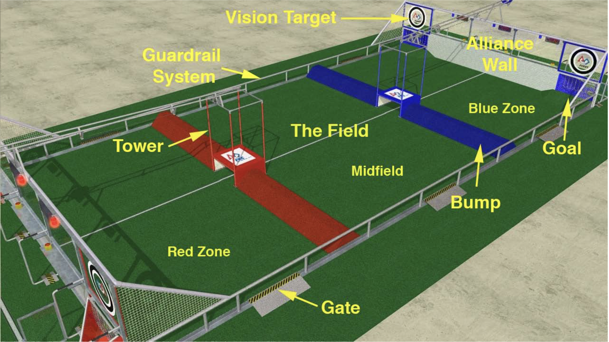

# 2010: Breakaway

---



### Robot: KICKAMATRON

---





### Competitions

---

#### Regular Season

* [Chesapeake Regional](https://www.thebluealliance.com/event/2010md)
* [Boston Regional](https://www.thebluealliance.com/event/2010ma)
  * _Judges Award_

#### Post Season

* Battlecry

---





---

### The Game

Breakaway is a game played on the FIELD (illustrated in the figure below). Two ALLIANCES, one red and one blue, composed of three _FIRST_ Robotics Competition (FRC) teams each, compete in each MATCH. The object of the game is to attain a higher score than your opponent by shooting BALLS into a GOAL, climbing on the ALLIANCE TOWER or PLATFORM, or by lifting an ALLIANCE ROBOT off the PLAYING SURFACE.

---



)







---

### Team Photo



---

