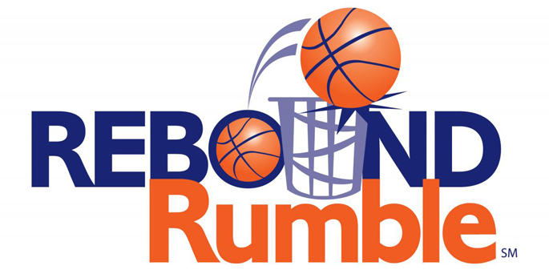



### Robot: Artemas

---





### Competitions

---

#### Regular Season

* [WPI Regional](https://www.thebluealliance.com/event/2012wor)
* [Washington DC Regional](https://www.thebluealliance.com/event/2012dc)
  * _Regional Winners_
  * _Team Spirit Award_

#### Post Season

* [Battlecry](https://www.thebluealliance.com/event/2012bc)

---





---

### The Game

Rebound Rumble℠ is played by two competing Alliances on a flat, 27 x 54 foot field. Each
Alliance consists of three robots. They compete to score as many basketballs into their hoops
as they can during a 2 minute and 15 second match. The higher the hoop in which the
basketball is scored, the more points the Alliance receives.

---









---

### Washington DC Regional: Finals - Match 2



---

### Team Photo



---

### Season Retrospective



---

