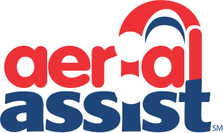



### Robot: Atlas

---





### Competitions

---

#### Regular Season

* [WPI](https://www.thebluealliance.com/event/2014mawor)
  * _Entrepreneurship Award_
* [Pine Tree](https://www.thebluealliance.com/event/2014melew)
  * _Creativity Award_

#### Post Season

* [Battlecry](https://www.thebluealliance.com/event/2014bc)

---





---

### The Game

ALLIANCES playing AERIAL ASSIST score BALLS in GOALS, over a TRUSS, and are rewarded bonus points for employing teamwork to achieve the objective.

---









---

### Chairman's Award Video



---

### Team Photo


---

### Lewiston District Qualifier Match 20



---

