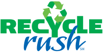



### Robot: Mantis

---





### Competitions

---

#### Regular Season

* [Granite State](https://www.thebluealliance.com/event/2015nhnas)
  * _District Chairman's Award_
* [Hartford](https://www.thebluealliance.com/event/2015cthar)
  * _Innovation in Control Award_
* [District Championship](https://www.thebluealliance.com/event/2015necmp)
  * _Regional Chairman's Award_
* [World Championship](https://www.thebluealliance.com/event/2015cars)

#### Post Season

* [Battlecry](https://www.thebluealliance.com/event/2015bc)

---





---

### The Game



RECYCLE RUSH is played by two (2) ALLIANCES of three (3) Teams each who compete simultaneously to score points by stacking TOTES,
placing RECYCLING CONTAINERS on top of stacked TOTES, and disposing of LITTER. 





---



### Chairman's Award Video



---

### Team Photo

