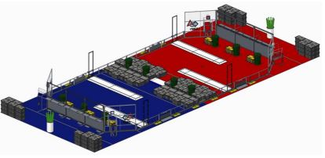
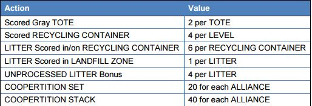

RECYCLE RUSH is a recycling-themed game played by two Alliances of three robots each. Robots score points by stacking totes on scoring platforms, capping those stacks with recycling containers, and properly disposing of pool noodles, representing litter. In keeping with the recycling theme of the game, all game pieces used are reusable or recyclable by teams in their home locations or by FIRST® at the end of the season.

Each Alliance competes on their respective 26 ft. by 27 ft. side of the playing field. Each match begins with a 15-second Autonomous Period in which robots operate independently of their drivers. During this period, robots attempt to earn points by moving themselves, their yellow totes, and their recycling containers into the area between the scoring platforms, called the Auto Zone.

During the remaining two minutes and 15 seconds of the match, called the Teleop Period, robots are controlled remotely by student drivers located behind the walls at the ends of the field. Teams on an Alliance work together to place as many totes on their white scoring platforms as possible. Alliances earn additional points for recycling containers placed on the scored totes, with containers at greater height earning more points.

Alliances also earn points for disposing of their litter in their Landfill Zone near the center of the field, or placing litter in or on scored recycling containers. Alliances that leave litter unprocessed on their side of the field at the end of the match, not in scoring position, will add points to the score of the other Alliance.

Alliances have an opportunity to earn Coopertition® points by coordinating with the other Alliance in the match. Coopertition points are awarded if, at some point in the match, there are at least four yellow totes on the step simultaneously. Coopertition points are doubled if the Alliances arrange at least four of those yellow totes in a single stack on the step.

Point values for the Teleop Period are in the table below

