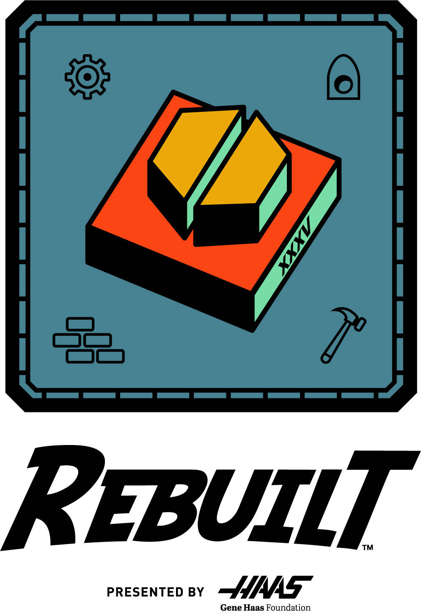

# 2026: Rebuilt

---



### Robot: BALL-E

---





### Competitions

---

#### Regular Season

* [Granite State](https://www.thebluealliance.com/event/2026nhbed)
  * _Judges' Award_
* [WPI](https://www.thebluealliance.com/event/2026mawor)

---





### The Game

In **REBUILT**, two competing alliances are invited to score fuel, cross obstacles, and climb
the tower before time runs out. Alliances earn additional rewards for meeting specific scoring thresholds.

During the first 20 seconds of the match, robots are autonomous. Without guidance from their drivers, robots
score fuel into their hub. Fuel can be pre-loaded into a robot, obtained from the human player, collected at the
depot, or picked up throughout the center of the field. Some robots may also climb the tower to obtain
additional points.

During the remaining 2 minutes and 20 seconds, drivers control their robots. Based on the result of
autonomous play, alliance hubs will alternate between active and inactive, shifting gameplay between both
sides of the field. Robots can collect fuel at any point in the match and may control any amount of fuel at a
time. Drivers control their robots to score fuel into their hub while it is active and may perform defensive
strategies or collect more fuel while their hub is inactive.

As time runs out, all hubs become active, allowing all robots to score. Robots can climb to the tower’s highest
heights to score additional points and claim match bonuses

The alliance that earns the most points wins the match!

---









---

### Robot Reveal



---

### Winning Judges Award at Granite State District Qualifier



---



