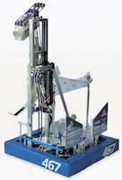



### [2026: Rebuilt](2026-rebuilt)
In 2026, Team 467 will compete at the _**Granite State**_ and **WPI** District Qualifiers.





---


### [2025: Reefscape](2025-reefscape)
In 2025, Team 467 competed with our robot **_NESSIE_** at the _**Southern Maine**_ and **Western New England** District Qualifiers, the **_New England District Championship_** and the **_World Championship_** in Houston.





---



### [2024: Crescendo](2024-crescendo)
In 2024, Team 467 competed with our robot **_SHUFFLE_** at the _**BSU**_ and **_Western New England_** District Qualifiers and the **_New England District Championship_**.





---



### [2023: Charged Up](2023-charged-up)
In 2023, Team 467 competed with our robot **_GRAB CRAB_** at the **_Granite State_** and **_Western New England_** District Qualifiers and the **_New England District Championship_**.





---



### [2022: Rapid React](2022-rapid-react)
In 2022, Team 467 competed with our robot **_GEOFFREY_** at the **_Granite State_** and **_Western New England_** District Qualifiers and the **_New England District Championship_**.





---



### [2020: Infinite Recharge](2020-infinite-recharge)
In 2020, Team 467 competed with our robot at the **_Granite State_** District Qualifiers. The remainder of the season was cancelled due to the COVID-19 pandemic.





---



### [2019: Destination Deep Space](2019-destination-deep-space)
In 2019, Team 467 competed with our robot at the **_Granite State_** and **_Greater Boston_** District Qualifiers.





---



### [2018: FIRST Power Up](2018-first-power-up)
In 2018, Team 467 competed with our robot **_ODYSSEY_** at the **_WPI_** and **_Southern CT_** District Qualifiers, the **_New England District Championship_** and the **_World Championship_** in Detroit.





---



### [2017: FIRST Steamworks](2017-first-steamworks)
In 2017, Team 467 competed with our robot **_MIRACLE_** at the **_Granite State_** and **_Rhode Island_** District Qualifiers





---



### [2016: FIRST Stronghold](2016-first-stronghold)
In 2016, Team 467 competed with our robot **_MONGOOSE_** at the **_WPI_** and **_Boston_** District Qualifiers and the **_New England District Championship_**.





---



### [2015: Recycle Rush](2015-recycle-rush)
In 2015, Team 467 competed with our robot **_MANTIS_** at the **_Granite State_** and **_Hartford_** District Qualifiers, the **_New England District Championship_** and the **_World Championship_** in St. Louis.





---



### [2014: Aerial Assist](2014-aerial-assist)
In 2014, Team 467 competed with our robot **_ATLAS_** at the **_WPI_** and **_Pine Tree_** District Qualifiers.





---



### [2013: Ultimate Ascent](2013-ultimate-ascent)
In 2013, Team 467 competed with our robot **_VORTEX_** at the **_WPI_** Regional Event and the **_World Championship_** in St. Louis.





---



### [2012: Rebound Rumble](2012-rebound-rumble)
In 2012, Team 467 competed with our robot **_ARTEMAS_** at the **_WPI_** and the **_Washington DC_** Regional Events.





---



### [2011: LOGO MOTION](2011-logo-motion)
In 2011, Team 467 competed with our robots **_WALLACE & GROMIT_** at the **_WPI_** and the **_Greater Toronto East_** Regional Events.





---



### [2010: Breakaway](2010-breakaway)
In 2010, Team 467 competed with our robot **_Kickamatron_** at the **_Chesapeake_** and the **_Boston_** Regional Events.





---



### [2009: Lunacy](2009-lunacy)
In 2009, Team 467 competed with our robot **_Dyson_** at the **_BAE Granite State_** and the **_Chesapeake_** Regional Events.





---



### [2008: FIRST Overdrive](2008-first-overdrive)
In 2008, Team 467 competed with our robot **_Roxanne_** at the **_Connecticut_** and the **_Philadelphia_** Regional Events.





---



### [2007: Rack 'n' Roll](2007-rack-n-roll)
In 2007, Team 467 competed with our robot at the **_Finger Lakes_** and the **_Boston_** Regional Events.



