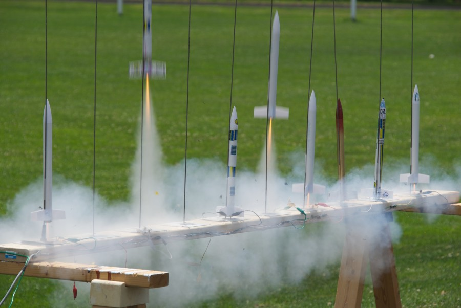

# Shrewsbury Robotics Summer Program



Science and Engineering play a big part in our everyday lives and in the world. We teach students about Science and Engineering by using Lego Robotics, Solar Powered Robots, Rockets and middle school level engineering challenges. They also get to have fun in the process and learn valuable team working skills.





Shrewsbury Robotics offers 4 weeks of summer activities each summer. The 4 weeks are broken down into one week sessions. Each student will participate in multiple activities:

- **Lego Robotics**
- **Rockets or Solar Powered Robots**
- **A variety of middle school science projects**

Each activity teaches students different aspects of Science, Engineering and Technology. All activities teach students about Teamwork, Compromise, Success, Failure and much much more!

The program is available to **students entering Grades 4 to 8**. There is no residency requirement. We operate a full week program, 8:30am to 3:30pm Monday through Friday.

The students are grouped into teams, each team is coached by one or more high school students who are members of the Robotics team and in most cases have been Lego League competitors themselves. The program is overseen by adult mentors.

Students need to bring a packed lunch with them, we have refrigerator space available for them to store it and a microwave if it is required. They may also bring a snack to eat at morning recess if they wish. We also recommend they bring a reusable water bottle.

A typical day might be scheduled as follows:-

    8:30  Arrival and team discussions
    8:45  Lego robot building
    10:00 Recess
    10:15 Solar robots or rocket building
    11:30 Lunch then recess
    12:15 Lego robot building
    1:30  Recess
    1:45  Lego or special project or solar robot/rocket
    3:00  Pack up

We alter this schedule as needed to ensure the students get adequate time to finish their rockets or solar robots. The solar robots and rockets are tested at the end of the week usually either Thursday or Friday, again this sometimes has to change if the weather looks unfavorable. Recess is outside when the weather is suitable, we play team games during recess and the students are encouraged to participate. If the weather is bad either wet or too hot we will play games or have other activities indoors instead.

On Friday we provide the students with a pizza lunch, this is included in the price. During Friday afternoon the students compete against the other teams using the Lego Robots they have been building during the week. This competition is based on the FIRST Lego League competition from the preceding season. Parents are invited to come and watch this.

All adult mentors working with the Shrewsbury High School Robotics team are CORI checked by Shrewsbury Public Schools.

**SUMMER 2023 information**\
**This year’s Lego competition is based on the FLL competition from fall 2023 – SUPERPOWERED**

#### Dates – Times: (All weeks run Monday to Friday)

    July 10th-14th        8:30am to 3:30pm (Lego Robotics & Rockets)
    July 17th-21st        8:30am to 3:30pm (Lego Robotics & Solar Powered Robots)
    July 24th-28th        8:30am to 3:30pm (Lego Robotics & Rockets)
    July 31st-August 4th  8:30am to 3:30pm (Lego Robotics & Solar Powered Robots)

#### Price:

Each week costs $300, this includes a Pizza lunch on Friday. You may sign-up for as many weeks as you want. Registration is not confirmed until we receive payment, payment is by credit or debit card during registration.

#### Location:

     Shrewsbury High School
     64 Holden St.
     Shrewsbury, MA 01545

#### Payment and cancellation policy:

A 50% non-refundable deposit is due at the time of registration. The remaining balance will be automatically charged to your payment method on June 1st.

If you cancel before June 1st we will not charge you the balance of the registration, but we will not refund your deposit.

Registration received after June 1st must be paid in full and no refunds will be given.

**Students are expected to behave in a safe and appropriate manner during camp**. Unexpected behavior will be discussed with the adult at pickup. Continued unexpected behavior may result in the student being asked to leave the camp. There will not be a refund for this.

***Shrewsbury Robotics is a part of Shrewsbury Public Schools and as such is a tax exempt organization.***

**Our tax ID is 04-6001300W**
